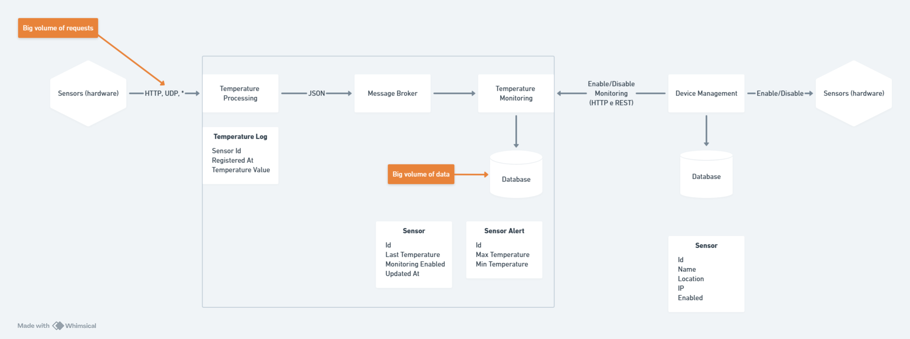

An educational microservices system for device management and temperature monitoring built with Spring Boot 3, RabbitMQ, and H2. It demonstrates CRUD, async messaging, and service-to-service communication.

## 🏗️ Architecture


- **Device Management (8080):** CRUD for sensors and enable/disable monitoring. Uses H2 for persistence and calls the Monitoring service for aggregated detail and toggling.
- **Temperature Processing (8081):** Ingests plain-text temperature readings and publishes them to RabbitMQ.
- **Temperature Monitoring (8082):** Consumes readings from RabbitMQ, stores logs, exposes query endpoints, monitoring status, and alert thresholds.
- **RabbitMQ:** Provided via `docker-compose` with management UI.

## 🧩 Microservices
- 🛠️ `device-management` (port 8080)
  - CRUD endpoints at `/api/sensors` (list, get, create, update, delete)
  - Monitoring aggregation at `/api/sensors/{sensorId}/detail`
  - Enable/disable monitoring at `/api/sensors/{sensorId}/enable`
  - H2 console enabled (`/h2-console`)

- ⚙️ `temperature-processing` (port 8081)
  - POST plain text temperature to `/api/sensors/{sensorId}/temperatures/data`
  - Publishes validated readings to RabbitMQ

- 📈 `temperature-monitoring` (port 8082)
  - Read logs: `GET /api/sensors/{sensorId}/temperatures`
  - Monitoring state: `GET|PUT|DELETE /api/sensors/{sensorId}/monitoring[/enable]`
  - Alerts: `GET|PUT|DELETE /api/sensors/{sensorId}/alert`

## 🛠️ Prerequisites
- JDK 21
- Docker (to run RabbitMQ via `docker-compose`)
- Bash or PowerShell (Gradle wrapper included)

## ▶️ Quick Start
1) Start RabbitMQ
   - `docker compose up -d` (ports: `5672`, `15672`; user/pass: `rabbitmq`/`rabbitmq`)
2) Start services (in separate terminals)
   - Device Management: `cd microservices/device-management && ./gradlew bootRun` (Windows: `gradlew.bat bootRun`)
   - Temperature Processing: `cd microservices/temperature-processing && ./gradlew bootRun`
   - Temperature Monitoring: `cd microservices/temperature-monitoring && ./gradlew bootRun`

## 📡 Example Requests
- Create a sensor (Device Management)
  - `POST http://localhost:8080/api/sensors`
  - Body:
    ```json
    {"name":"Sensor A","ip":"10.0.0.5","location":"Lab","protocol":"HTTP","model":"X100"}
    ```
- Enable monitoring for a sensor
  - `PUT http://localhost:8080/api/sensors/{sensorId}/enable`
- Send a temperature reading (Processing)
  - `curl -X POST -H "Content-Type: text/plain" \
    --data "22.7" \
    http://localhost:8081/api/sensors/{sensorId}/temperatures/data`
- Query temperature logs (Monitoring)
  - `GET http://localhost:8082/api/sensors/{sensorId}/temperatures?page=0&size=20`

## 🗃️ Data & Messaging
- Databases: H2 file stores per service (see each service `application.yml`).
- Messaging: RabbitMQ at `localhost:5672` with management UI at `http://localhost:15672`.

## 📂 Project Structure
```
microservices/
  device-management/            # 🛠️ CRUD for sensors (8080)
  temperature-processing/       # ⚙️ Ingest + publish to RabbitMQ (8081)
  temperature-monitoring/       # 📈 Consume + query logs (8082)
configs/
  rabbitmq/
docs/
  assets/sensors.png
docker-compose.yml              # RabbitMQ services
```

## 🧪 Development
- Run tests: `./gradlew test` within each microservice folder.
- H2 console: `http://localhost:<port>/h2-console` (user: `sa`, pass: `123`).
