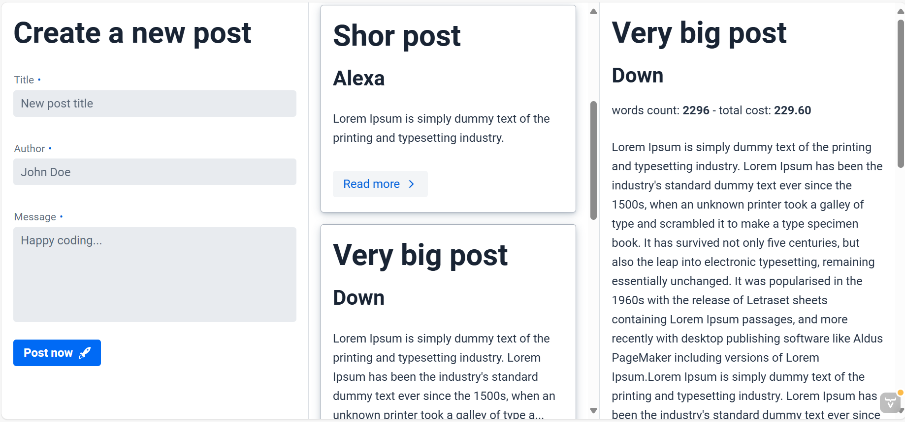

- Purpose: Accepts and stores posts, publishes processing requests, and updates metrics when results arrive.
- Tech stack: Java 21, Spring Boot 3, Vaadin 24, H2, Spring AMQP.
- Data model: `id` (UUID), `title`, `body`, `author`, `createdAt`, `wordCount` (after processing), `calculatedValue` (after processing).
- Messaging: Publishes to exchange `post-service.post-processing.v1.e`; listens to queue `post-service.post-processing-result.v1.q`.
- UI: Vaadin UI at `/` to create and browse posts with live metrics.
- Persistence: H2 file DB at `~/posts-db` (H2 Console at `/h2-console`).
- API: See details in 📡 REST API (post) below.

## 📡 REST API
- Create post
    - `POST /api/posts`
    - Body:
      {
      "title": "Hello",
      "body": "Happy coding...",
      "author": "Jane Doe"
      }
    - Response example (initially, metrics may be absent until processed):
      {
      "id": "<uuid>",
      "title": "Hello",
      "body": "Happy coding...",
      "author": "Jane Doe",
      "wordCount": null,
      "calculatedValue": null
      }
- Get by id
    - `GET /api/posts/{id}`
- Search (paged)
    - `GET /api/posts?size=5&page=0&sort=createdAt,desc`

## 🖥️ UI

- Open `http://localhost:8080`
- Left: form to create a post
- Middle: list of posts with summaries
- Right: details panel showing metrics once processed
